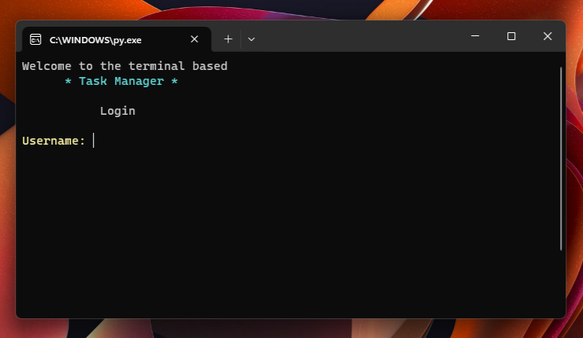
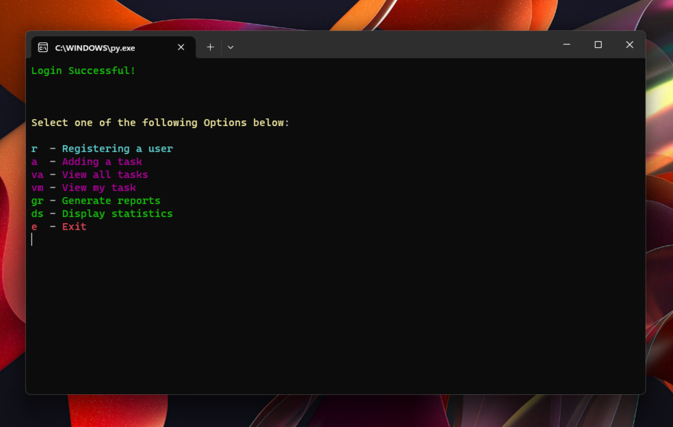

# :clipboard: TERMINAL TASK MANAGER :clipboard:

## :wave: Welcome to Terminal Task Manager!
Terminal Task Manager is a command-line Python application that allows users to manage tasks. Users can register new accounts, add tasks, view tasks, and generate reports. The program features a user-friendly interface and provides functionality to enhance task management.

## :star: Features

User Registration:&nbsp;&nbsp;&nbsp;&nbsp;&nbsp;Users can register new accounts with unique usernames and passwords.  
Task Management:&nbsp;&nbsp;&nbsp; Users can add new tasks, view all tasks, and view tasks assigned to them.  
Task Editing:&nbsp;&nbsp;&nbsp;&nbsp;&nbsp;&nbsp;&nbsp;&nbsp;&nbsp;&nbsp;&nbsp;&nbsp;&nbsp; Users can mark tasks as completed, edit task details, and view detailed task information.  
Reports: &nbsp;&nbsp;&nbsp;&nbsp;&nbsp;&nbsp;&nbsp;&nbsp;&nbsp;&nbsp;&nbsp;&nbsp;&nbsp;&nbsp;&nbsp;&nbsp;&nbsp;&nbsp;&nbsp;&nbsp;Generate and view reports on overall task statistics and user-specific statistics.  

## :rocket: Getting Started

1. Clone the repository.

  ```bash
  git clone https://github.com/YourUsername/task-manager.git
  cd task-manager
  ```

2. Install requirements.

   ```
   pip install -r requirements.txt
   ```

4. Run the Task Manager application.

  ```bash
  python task_manager.py
  ```

Follow the on-screen instructions to log in, manage tasks, and utilize the various features of the Task Manager.

## :clipboard: Usage

Register User:&nbsp;&nbsp;&nbsp;&nbsp;&nbsp;&nbsp;&nbsp;&nbsp;&nbsp;Create a new user account using a unique username and password.  
Add Task:&nbsp;&nbsp;&nbsp;&nbsp;&nbsp;&nbsp;&nbsp;&nbsp;&nbsp;&nbsp;&nbsp;&nbsp;&nbsp;&nbsp;&nbsp;&nbsp;Add a new task with details such as title, description, due date, and assigned user.  
View All Tasks:&nbsp;&nbsp;&nbsp;&nbsp;&nbsp;&nbsp;&nbsp;&nbsp;Display a list of all tasks with relevant details.  
View My Tasks:&nbsp;&nbsp;&nbsp;&nbsp;&nbsp;&nbsp;&nbsp;View tasks assigned to the currently logged-in user.  
Edit Task:&nbsp;&nbsp;&nbsp;&nbsp;&nbsp;&nbsp;&nbsp;&nbsp;&nbsp;&nbsp;&nbsp;&nbsp;&nbsp;&nbsp;&nbsp;&nbsp;Edit task details, mark tasks as completed, and update due dates.  
Generate Reports:&nbsp;&nbsp;Generate reports on task and user statistics.  

## :framed_picture: Screenshots

<p float="left">
  
  
</p>

## :page_facing_up: License

This project is licensed under the MIT License - see the LICENSE file for details.

## :fax: 

Have questions or suggestions? Feel free to reach out:

[Email](kvalentin95@gmail.com)  
[LinkedIn](https://www.linkedin.com/in/valentin-kalanyos-00a245199/)


## :pray: Acknowledgments

A special thanks to the developers of [Colorama](https://pypi.org/project/colorama/), a Python library that makes terminal text styling and coloring easy. The vibrant colors in this Minesweeper game are powered by Colorama, enhancing the overall user experience.

Colorama: © 2011 Jonathan Hartley, licensed under the BSD 3-Clause License. Check out the Colorama documentation for more information on this fantastic library.
